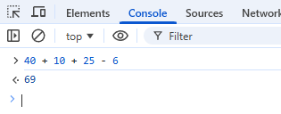

# Lesson 6 - Hello World!

- Open Chrome, go into Developer Tools > Console and type

```js
let js = "awesome";
if (js === "awesome") alert("Hello World! JavaScript is awesome.");
```

The browser should popup a box which says `Hello World! JavaScript is awesome.`

This works because we set `js` to equal `awesome` if it didn't then the popup would not display.

We can also do math

```js
40 + 10 + 25 - 6;
```


